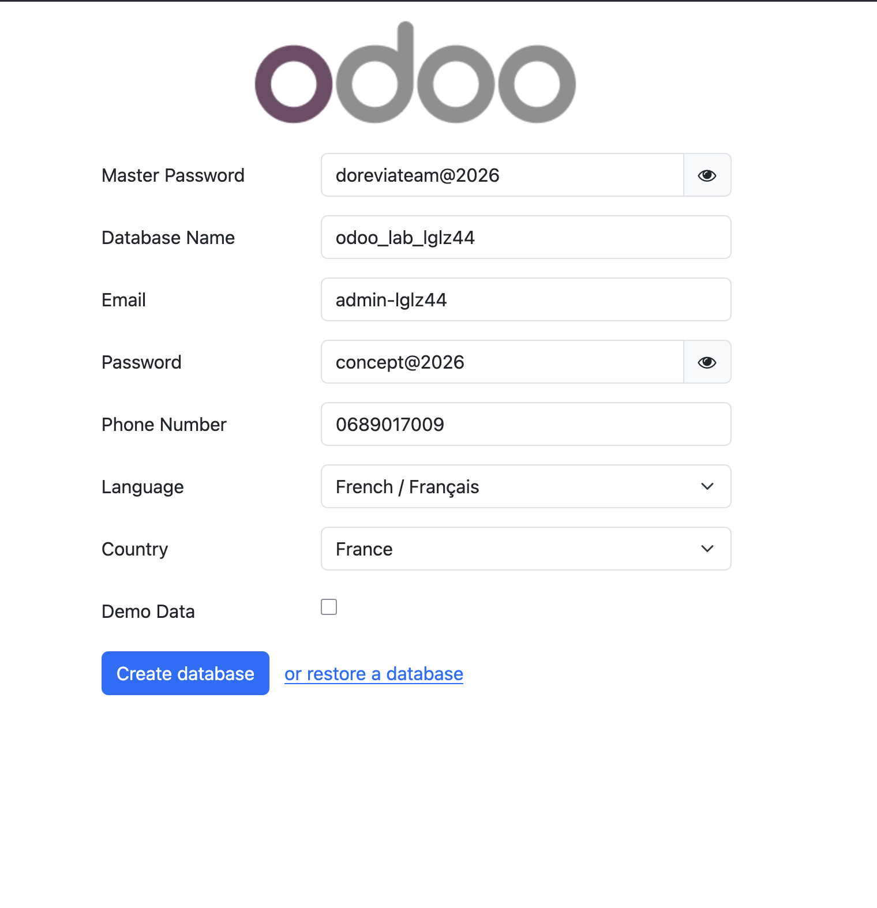

# Rapport d'implémentation — Instance Odoo 18 lglz44

**Date** : 2026-02-12  
**Tenant** : lglz44  
**URL** : https://odoo.lab.lglz44.doreviateam.com  
**Référence** : [PLAN_INSTANCE_ODOO_18_LGLZ44_2026-02-12.md](./PLAN_INSTANCE_ODOO_18_LGLZ44_2026-02-12.md)

---

## 1. Contexte

Mise en place d'une nouvelle instance Odoo 18 pour le tenant **lglz44**, sans branchement Dorevia Vault (prévu ultérieurement).

---

## 2. Réalisations

### 2.1 Fichiers créés

| Fichier | Description |
|---------|-------------|
| `tenants/lglz44/state/manifest.json` | Manifest tenant (universes: odoo, environments: lab, units.platform: []) |
| `tenants/lglz44/apps/odoo/lab/odoo.conf` | Configuration Odoo (db, addons, proxy_mode, sans queue_job) |
| `tenants/lglz44/apps/odoo/lab/docker-compose.yml` | Compose Odoo + PostgreSQL (copié depuis rendered) |

### 2.2 Artefacts générés (render)

- `tenants/lglz44/rendered/lab/odoo/docker-compose.yml`
- `tenants/lglz44/rendered/lab/caddy/Caddyfile`
- Platform non généré (units.platform vide — comportement attendu)

### 2.3 Déploiement

| Composant | Statut |
|-----------|--------|
| PostgreSQL | `odoo_db_lab_lglz44` — démarré |
| Odoo 18 | `odoo_lab_lglz44` — démarré |
| Volumes | `odoo_lab_lglz44_db`, `odoo_lab_lglz44_data` — créés |
| Réseau | Attaché à `dorevia-network` |

### 2.4 Gateway

- Caddyfile agrégé (7 Caddyfiles collectés, dont lglz44)
- Bloc ajouté : `odoo.lab.lglz44.doreviateam.com` → `odoo_lab_lglz44:8069`
- Caddy rechargé avec succès

---

## 3. Méthode utilisée

L'étape **apply** du script dorevia.sh n'a pas été utilisée car le tenant a `units.platform: []` et le script attend un fichier `rendered/platform/docker-compose.yml`. Le déploiement a été effectué manuellement :

1. Copie du docker-compose rendu vers `apps/odoo/lab/`
2. `docker compose -p dorevia_odoo_lab_lglz44 up -d`
3. `dorevia.sh gateway aggregate`
4. `docker compose -f units/gateway/docker-compose.yml exec caddy caddy reload --config /etc/caddy/Caddyfile`

---

## 4. Points d'attention

- **Volume `oca_extra_addons`** : Avertissement Docker (volume partagé avec dorevia_odoo_lab_core). Comportement normal pour les addons OCA.
- **Test HTTPS** : À valider manuellement depuis le serveur ou une machine avec accès au DNS :
  ```bash
  curl -I https://odoo.lab.lglz44.doreviateam.com
  ```

---

## 5. Validation — Création de la base Odoo

Premier accès à https://odoo.lab.lglz44.doreviateam.com : écran de création de base (database name `odoo_lab_lglz44`).



---

## 6. Prochaines étapes possibles

1. **Base créée** : Finaliser la configuration initiale Odoo (modules, société, etc.).
2. **Branchement Vault** : Suivre la section 6 du plan lorsque Dorevia Vault sera activé.

---

## 7. Checklist post-déploiement

| Vérification | Commande |
|--------------|----------|
| Conteneurs up | `docker ps \| grep odoo_lab_lglz44` |
| Réseau | `docker inspect odoo_lab_lglz44 \| grep dorevia-network` |
| HTTPS | `curl -I https://odoo.lab.lglz44.doreviateam.com` |

---

## Génération PDF

Une version HTML est disponible : [RAPPORT_IMPLEMENTATION_LGLZ44_2026-02-12.html](./RAPPORT_IMPLEMENTATION_LGLZ44_2026-02-12.html)

Pour obtenir un PDF : ouvrir ce fichier HTML dans un navigateur, puis **Ctrl+P** (ou Cmd+P) → **Enregistrer au format PDF**.

Si `pandoc` est installé : `pandoc RAPPORT_IMPLEMENTATION_LGLZ44_2026-02-12.md -o RAPPORT_IMPLEMENTATION_LGLZ44_2026-02-12.pdf`
