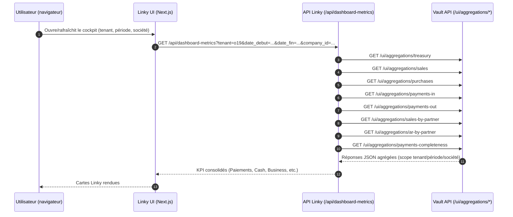

# RAPPORT DE SITUATION MOA

## Chaîne ERP -> DVIG -> Vault -> Linky (tenant o19)

Date: 09/03/2026  
Périmètre: paiements, cash, business, trésorerie, preuves scellées

---

## 1) Objectif métier

Garantir qu'un flux financier saisi et validé dans l'ERP soit:

1. transmis de manière fiable,
2. scellé et traçable,
3. consolidé dans le Vault,
4. affiché de façon cohérente dans Linky.

La cible MOA est une chaîne auditable de bout en bout, avec des indicateurs stables et explicables.

**Principe de gouvernance des données**

Vault constitue la source de vérité scellée du système.  
Linky est une interface de lecture et de pilotage reposant exclusivement sur ces données probantes.

**Promesse produit (formulation stratégique)**

Réduire le **temps de vérité financière** entre événement ERP, preuve scellée et disponibilité cockpit, pour passer d'une logique de pilotage différé à une logique de décision quasi temps réel.

### Chaîne de valeur (lecture MOA)

```text
Odoo (ERP)
   │
   │ Paiements postés (source métier)
   ▼
DVIG
   │
   │ Événements authentifiés et routés
   ▼
Vault
   │
   │ Données scellées + agrégations financières
   ▼
Linky
   │
   │ Restitution des KPI
   ▼
Cockpit de gouvernance
```

### Exigence de performance MOA (SLA)

**Exigence cible (contractuelle)**  
`ERP event captured -> Vault sealed <= 5 s`

**Formulation mesurable (SLA)**  
`T_sla = vault_sealed_at - erp_event_captured_at`  
Objectif principal: `T_sla <= 5 s` (P95).  
Objectif de robustesse: `T_sla <= 10 s` (P99).

**Objectif UX complémentaire (SLO)**  
`Vault sealed -> Linky data available <= 2 s` (P95), avec cible robuste `<= 4 s` (P99).

**Point d'attention important**  
Avec l'implémentation actuelle basée sur CRON (`Vault Send Payments` toutes les 2 min), ce SLA n'est **pas garanti** de bout en bout depuis le posting ERP.  
Le SLA < 5 s devient réaliste uniquement:

- soit à partir du moment où l'événement est déjà capturé côté DVIG,
- soit après passage à un mode quasi temps réel (déclenchement immédiat au posting + pipeline sans attente CRON longue).

**Décision MOA recommandée**  
Valider ce SLA comme cible contractuelle (`ERP event captured -> Vault sealed <= 5 s`) et ouvrir une action d'alignement technique pour supprimer la dépendance au cycle CRON 2 min sur le segment ERP -> DVIG.

### Plan d'atteinte du SLA 5 secondes

#### Principe

Pour tenir `ERP event captured -> Vault sealed <= 5 s`, le pipeline doit devenir **événementiel** (quasi temps réel), et non plus dépendre d'un batch CRON 2 min.

#### Rôle attendu de `queue_job`

`queue_job` est un levier central pour atteindre l'objectif:

- déclenchement immédiat au `posting` ERP,
- exécution asynchrone sans attente CRON,
- retries et backoff contrôlés,
- observabilité des files (en attente / en erreur / durée).

En pratique, `queue_job` est nécessaire mais pas suffisant: DVIG et Vault doivent aussi traiter les événements sans délai batch.

#### Architecture cible (résumé)

1. `action_post` Odoo -> enqueue immédiat d'un job `send_to_dvig`.
2. Worker `queue_job` dédié -> appel `DVIG /ingest` en < 1 s.
3. DVIG -> traitement outbox immédiat (scheduler court ou trigger process direct).
4. Vault -> persistance + agrégation mises à jour à l'arrivée.
5. Linky -> lecture no-store, rafraîchissement court, restitution KPI.

#### Budget temps recommandé (P95)

- ERP -> enqueue job: `< 0,2 s`
- queue_job -> DVIG ingest: `< 0,8 s`
- DVIG -> Vault (write + agrégation): `< 2,0 s`
- Vault sealed -> Linky data available: `< 2,0 s` (objectif UX complémentaire)
- **Total cible P95: `< 4,5 s`**

#### Plan de mise en oeuvre (3 lots)

**Lot 1 - Quick win (prioritaire)**  

- Réactiver `queue_job` sur les paiements Odoo.
- Créer un worker dédié.
- Conserver idempotence (clé fonctionnelle) et retries.
- Garder un CRON de secours uniquement pour rattrapage.

**Lot 2 - Pipeline temps réel**  

- Forcer le traitement outbox DVIG immédiatement après ingest.
- Réduire la latence d'agrégation Vault.
- Vérifier que le tenant/scope est propagé sans ambiguïté.

**Lot 3 - Pilotage SLA**  

- Mesurer `event_captured_at`, `dvig_ingested_at`, `vault_sealed_at`, `vault_aggregated_at`, `linky_displayed_at`.
- Produire P50/P95/P99.
- Déclencher alerte si P95 > 5 s.
- Mesurer et piloter aussi `T_ux = linky_data_available_at - vault_sealed_at` (P95 <= 2 s, P99 <= 4 s).

#### Critères d'acceptation MOA

- 95% des événements respectent `ERP event captured -> Vault sealed <= 5 s`.
- 99% des événements respectent `ERP event captured -> Vault sealed <= 10 s`.
- 95% des événements respectent `Vault sealed -> Linky data available <= 2 s`.
- 99% des événements respectent `Vault sealed -> Linky data available <= 4 s`.
- Zéro perte d'événement (idempotence vérifiée).
- Aucune variation incohérente des cartes Linky à filtres constants.

### Décision à valider en COPIL (Go / No-Go)

**Décision proposée: GO sous conditions**

Valider le passage vers une chaîne quasi temps réel via `queue_job`, avec maintien d'un filet de sécurité CRON pour rattrapage.

**Conditions de GO**

- `queue_job` activé en production sur le flux paiements.
- Worker dédié dimensionné et supervisé.
- Idempotence validée sur le couple événement/tenant/source.
- Tableaux de bord SLA (P50/P95/P99) disponibles pour la MOA.

**Motifs de NO-GO (bloquants)**

- Pas de preuve de non-régression sur pertes/doublons.
- Pas de métriques de latence exploitables.
- Pas de plan de rollback.

**Risque résiduel accepté (phase transitoire)**

- Pendant la montée en charge initiale, tolérance ponctuelle au-delà de 5 s,
- à condition de rester dans la cible de stabilisation (`ERP event captured -> Vault sealed`: P95 <= 5 s, P99 <= 10 s; `Vault sealed -> Linky data available`: P95 <= 2 s, P99 <= 4 s) à la fin du lot.

**Prochain jalon proposé**

- J+5 ouvrés: revue technique + mesure de base (avant/après).
- J+10 ouvrés: décision de généralisation tenant o19.
- J+15 ouvrés: extension aux autres tenants si KPIs SLA conformes.

---

## 2) Vue d'ensemble du processus complet

### Etape A - ERP (Odoo)

- La source fonctionnelle initiale est Odoo (tenant `o19`).
- Lorsqu'un paiement est posté, il est marqué pour envoi (`todo`/`failed_soft`) via le connecteur.
- Le routage est géré par des CRONs (pas de `queue_job` dans cette implémentation):
  - `Vault Send Payments` (toutes les 2 min): envoi vers DVIG.
  - `Vault Fetch Proof Payments` (toutes les 1 min): récupération des preuves.

**Points de contrôle ERP**

- Configuration DVIG présente: URL, token, source, tenant.
- Token cohérent avec le tenant (`o19`).
- Paiements effectivement éligibles (`dorevia_vault_status`).

### Etape B - DVIG

- Odoo envoie les événements à `POST /ingest`.
- DVIG applique authentification et règles de tenant/source.
- Les événements sont placés en outbox puis forwardés vers Vault.
- Le traitement est assuré par scheduler interne DVIG et peut être accéléré via `POST /internal/outbox/process`.

**Points de contrôle DVIG**

- Pas de 401/403 sur `/ingest`.
- Outbox non bloquée (pas d'accumulation d'événements en échec).
- Pas d'erreurs de forwarding vers Vault.

### Etape C - Vault

- Vault reçoit les événements avec `X-Tenant: o19`.
- Les agrégations UI (`/ui/aggregations/...`) servent de source officielle Linky.
- L'endpoint `payments-completeness` permet de comparer ERP vs Vault.

**Points de contrôle Vault**

- Comptages et montants cohérents sur la période.
- `missing_odoo_ids` vide quand la chaîne est totalement rattrapée.
- Réponses d'agrégations stables sur appels répétés.

### Etape D - Linky

- Linky interroge les APIs internes (`/api/dashboard-metrics`, `/api/sales`, `/api/payments-in`, etc.).
- Ces APIs proxifient et agrègent les données Vault.
- Les cartes affichent les KPI métiers (`Paiements`, `Cash`, `Business`, etc.).

**Points de contrôle Linky**

- Stabilité inter-refresh (mêmes filtres => mêmes valeurs).
- Cohérence intra-page (cartes alignées entre elles).
- Cohérence devise/montants et logique de fallback explicite.

### 2.1 Séquence détaillée Vault -> Linky (technique)



**Explication MOA simplifiée**

1. L'utilisateur rafraîchit la page Linky.  
2. Linky appelle son endpoint interne `dashboard-metrics`.  
3. Cet endpoint collecte plusieurs agrégations dans Vault.  
4. Il applique les règles de consolidation (complétude, stabilité, fallback).  
5. Il renvoie un JSON unique que les cartes affichent.

**Règles de fiabilité mises en place**

- Le badge global de preuves scellées est distingué de la complétude du scope affiché.
- Le KPI `Business` est consolidé à partir de la meilleure source disponible.
- Le KPI `Cash` est durci contre les réponses transitoires incomplètes.

### 2.2 Comment lire un écart (guide MOA)

**Cas 1 - Ecart de pipeline (amont)**

- Symptôme: `ERP` et `Vault` divergent (`payments-completeness` non aligné).
- Interprétation: la preuve n'est pas encore complètement passée dans la chaîne Odoo -> DVIG -> Vault.
- Action: vérifier CRON Odoo, token/config DVIG, logs outbox/forward DVIG.

**Cas 2 - Ecart de restitution (aval)**

- Symptôme: Vault est cohérent mais une carte Linky varie ou affiche une valeur incohérente.
- Interprétation: problème de consolidation/affichage côté Linky.
- Action: contrôler `/api/dashboard-metrics` sur appels répétés avec les mêmes filtres.

**Règle de décision MOA**

- Si Vault est stable et Linky varie: incident applicatif Linky.
- Si Vault varie lui-même: incident de pipeline de données.
- Si les deux sont stables mais différents de l'ERP: rattrapage de preuves incomplet.

---

## 3) Incidents observés pendant la qualification

### 3.1 Symptôme fonctionnel

- Entre deux rafraîchissements consécutifs sur la même vue:
  - `Business` alternait entre `+ 400,00 $` et `+ 4 387,00 EUR`.
  - `Cash` alternait entre `+ 1 297,00` et `+ 3 390,00`.
- `Paiements` restait globalement stable.

### 3.2 Risque MOA

- Perte de confiance utilisateur (cockpit perçu comme non fiable).
- Difficulté d'interprétation des écarts ERP/Vault.
- Risque de mauvaise décision de pilotage court terme.

---

## 4) Actions correctives réalisées

## 4.1 Côté Linky (API dashboard)

Correctifs appliqués dans `units/dorevia-linky/app/api/dashboard-metrics/route.ts`:

- Séparation claire entre:
  - le badge global de preuves scellées (niveau tenant),
  - la complétude du scope affiché (tenant + période + société).
- Durcissement `Business`:
  - priorisation d'une source consolidée (sales-by-partner / ERP signed),
  - suppression du retour erratique à `400`.
- Durcissement `Cash`:
  - lecture renforcée des agrégats `payments-in/out`,
  - sélection de la valeur la plus complète,
  - garde-fou final pour éviter une sous-valorisation transitoire.

## 4.2 Redéploiements

- Rebuild image Linky `dorevia/linky:vault-only-2026-02-28`.
- Recréation du conteneur `linky_lab_o19`.
- Vérifications API répétées après déploiement.

---

## 5) Résultat de stabilisation (constat actuel)

- `Business`: stabilisé sur `+ 4 387,00 EUR` sur appels consécutifs.
- `Cash`: stabilisé sur `+ 3 390,00 EUR` sur série de contrôles post-durcissement.
- `Paiements`: valeur stable et cohérente avec la logique de couverture trésorerie.

Conclusion opérationnelle: la présentation Linky est désormais significativement plus robuste et cohérente pour l'usage MOA.

---

## 6) Gouvernance de données: ce que la MOA doit retenir

1. **ERP est la source de vérité métier initiale**.  
2. **Vault est la source de vérité scellée pour la restitution Linky**.  
3. **DVIG est le bus de preuve et d'acheminement** (contrôle d'authentification + outbox).  
4. Un écart ERP/Vault n'est pas un bug d'affichage en soi: c'est un signal de rattrapage/complétude.  
5. Linky ne doit afficher des KPI décisionnels qu'avec une complétude cohérente.

---

## 7) Procédure standard de contrôle MOA (runbook)

### Quotidien (5 min)

- Ouvrir Linky tenant `o19`, même filtre période/société, faire 3 refresh:
  - vérifier stabilité de `Paiements`, `Cash`, `Business`.
- Vérifier le badge de preuves scellées.

### Hebdomadaire (10-15 min)

- Vérifier `payments-completeness` sur la période:
  - `erp_count` vs `payments_count`,
  - `erp_sum_amount_signed` vs `payments_sum_amount_signed`,
  - `missing_odoo_ids`.
- Contrôler l'exécution récente des CRONs Odoo.

### En cas d'alerte

- Vérifier d'abord la configuration tenant/token Odoo->DVIG.
- Vérifier ensuite logs DVIG (ingest/outbox/forward).
- Vérifier enfin agrégations Vault et stabilité des endpoints.

---

## 8) Limites et points de vigilance

- Le durcissement Linky traite la restitution et la robustesse de lecture.
- La convergence totale ERP <-> Vault dépend toujours:
  - du bon envoi Odoo,
  - du traitement DVIG,
  - de la complétude réelle des preuves dans Vault.
- Si `missing_odoo_ids` persiste, le sujet est amont flux de preuve, pas uniquement UI.

---

## 9) Recommandations MOA / MCO

- Formaliser et piloter le SLA `ERP event captured -> Vault sealed <= 5 s` (P95) avec suivi P99 <= 10 s.
- Formaliser et piloter l'objectif UX complémentaire `Vault sealed -> Linky data available <= 2 s` (P95) avec suivi P99 <= 4 s.
- Mettre une alerte automatique si:
  - CRON Odoo non exécuté,
  - erreurs DVIG > seuil,
  - divergence ERP/Vault persistante.
- Conserver une preuve de recette mensuelle (capture + export JSON des endpoints clés).

---

## 10) Synthèse exécutive

La chaîne `ERP -> DVIG -> Vault -> Linky` est en place et désormais documentée avec des contrôles précis par maillon.  
Les instabilités d'affichage observées en front ont été corrigées et redéployées.  
La MOA dispose maintenant d'un cadre clair pour distinguer:

- les écarts de **pipeline de preuve** (amont),
- des problèmes de **restitution cockpit** (aval),

et piloter la fiabilité de bout en bout.

---

## 11) Lexique SLA

- **SLA**: engagement de niveau de service mesurable.
- **SLO**: objectif opérationnel interne utilisé pour tenir le SLA.
- **SLI**: indicateur mesuré (latence, disponibilité, taux d'erreur) servant à calculer le SLA.
- **ERP event captured** (`erp_event_captured_at`): horodatage de capture de l'événement métier côté ERP/connecteur.
- **Vault sealed** (`vault_sealed_at`): horodatage où la preuve est effectivement scellée et persistée dans Vault.
- **Mesure SLA principale** (`T_sla`): `vault_sealed_at - erp_event_captured_at`.
- **Exigence contractuelle**: `ERP event captured -> Vault sealed <= 5 s` au **P95**.
- **Mesure UX complémentaire** (`T_ux`): `linky_data_available_at - vault_sealed_at`.
- **Objectif UX complémentaire (SLO)**: `Vault sealed -> Linky data available <= 2 s` au **P95** (cible robuste P99 `<= 4 s`).
- **P95**: 95% des événements sont en dessous du seuil de latence.
- **P99**: 99% des événements sont en dessous du seuil (cible robuste: `<= 10 s`).
- **Latence bout en bout**: délai total entre capture ERP et scellement Vault.
- **Idempotence**: garantie qu'un même événement retraité ne crée pas de doublon métier.
- **Rattrapage**: mécanisme de reprise (ex: CRON de secours) pour événements non traités en temps réel.
- **Perte d'événement**: événement capturé mais jamais scellé (incident critique).
- **Divergence ERP/Vault**: écart de comptage ou montant entre source ERP et données scellées Vault.

## 12) Addendum d'alignement MOA (mise a jour 2026-03-09)

### Etat de reference fonctionnel (tenant `o19`)

- Base Odoo lab nettoyee des donnees de campagne: `721` paiements `SLA-*` supprimes.
- Paiements metier restants: `4` (memo `FAC/*`).
- Lecture cockpit validee:
  - Total paiements periode: `4 387,00 EUR`
  - Rapproche: `996,00 EUR`
  - A rapprocher: `3 391,00 EUR`
  - Position validee (Vault) en tresorerie: `996,00 EUR`

### Message a retenir pour la MOA

- Odoo porte l'activite comptable.
- Vault porte la verite scellee/probante.
- Linky rend visible l'ecart ERP vs preuve et pilote le rapprochement.
